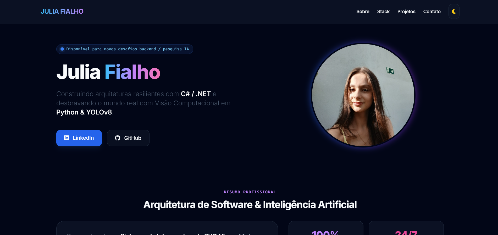

## Julia Fialho | Personal Portfolio & Software Engineer Showcase ##

Welcome to the official repository of my personal portfolio. This interactive platform showcases my academic journey at PUC Minas, my research in Applied Artificial Intelligence, and my expertise in building high-performance backend systems.

🔗 Live Demo: [https://meu-portifolio-five-jade.vercel.app/](https://meu-portifolio-five-jade.vercel.app/)

✨ Features & Highlights

🌓 Advanced Theme Engine: Smooth CSS-variable-driven transitions between a crisp Cobalt Light Mode and a deep Midnight Purple Dark Mode.

📱 Fluid Bento-Grid Layout: Asymmetric structural blocks presenting skills, background, and stats adaptively on desktop, tablet, and mobile devices.

📧 Form Delivery Pipeline: Lightweight, serverless email integration with Web3Forms, using asynchronous fetch requests and active state validation (UI loading states/dynamic alerts).

🛠️ Production-Ready Performance: Zero unnecessary library bloat, optimized asset delivery, and strict responsive design.

### Interface: ###

## 🛠️ Tech Stack & Domain Expertise ##

**Frontend Engineering**

* Core: React (Hooks, Context, State Management), JavaScript (ES6+), HTML5, CSS3.

* Styling: Tailwind CSS (utility-first, custom dark mode extensions), Glassmorphism custom filters.

* Assets: FontAwesome 6, Google Fonts (Inter & Fira Code).

**Backend & Architecture**

* Core: C# / .NET 8, ASP.NET Core Web API.

* Design Patterns: Clean Architecture, Domain-Driven Design (DDD), Repository Pattern, SOLID Principles.

* ORM & Database: Entity Framework Core, SQL Server (optimization, indexing, complex querying).

**Artificial Intelligence & Research**

* Frameworks: Python, PyTorch, OpenCV, YOLOv8 (You Only Look Once) for real-time object tracking.

* Domains: Computer Vision, Convolutional Neural Networks (CNNs), Medical AI Automation.

**DevOps & Tooling**

* Tools: Git, GitHub Actions, Vercel, Microsoft Azure, VS Code, Visual Studio.
